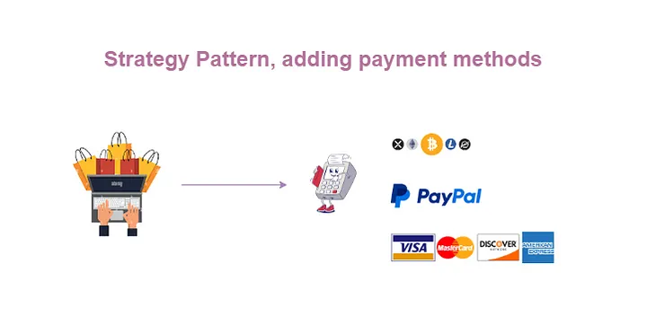

# Strategy Design Pattern

## Problem

Ban đầu có 1 phương thức thanh toán nhưng về sau tăng số lượng phương thức thanh toán lên đòi hỏi hàm PaymentMethod phải if else để xử lý.
Qua thời gian phải cập nhật một số logic về thanh toán khiến cho hàm đó càng trở nên phức tạp và khó bảo trì hơn.
Vi phạm nguyên tắc đóng mở: Mỗi lần một loại thanh toán được thêm vào bạn phải thay đổi lớp đó


## Solution 

Khi thêm một chiến lược mới bạn nên thêm một class. Nó giúp mở rộng chức năng mà không làm thay đổi code người dùng

## Class Diagram


## Example



```C#
public class PaymentProcessor
{
    public void PaymentMethod(decimal amount, string method)
    {
        if (method == "CreditCard")
        {
            Console.WriteLine($"Processing {amount} via Credit Card");
        }
        else if (method == "Paypal")
        {
            Console.WriteLine($"Processing {amount} via PayPal");
        }
        // As new payment methods are added, more if-else statements are added here
    }
}
```

